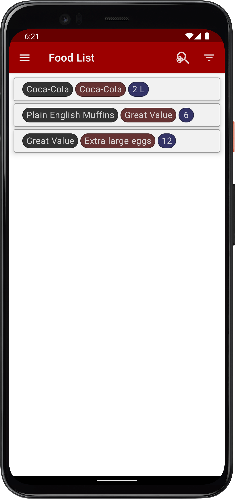
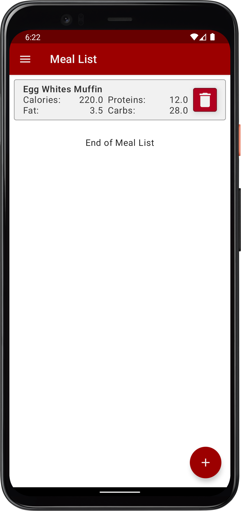
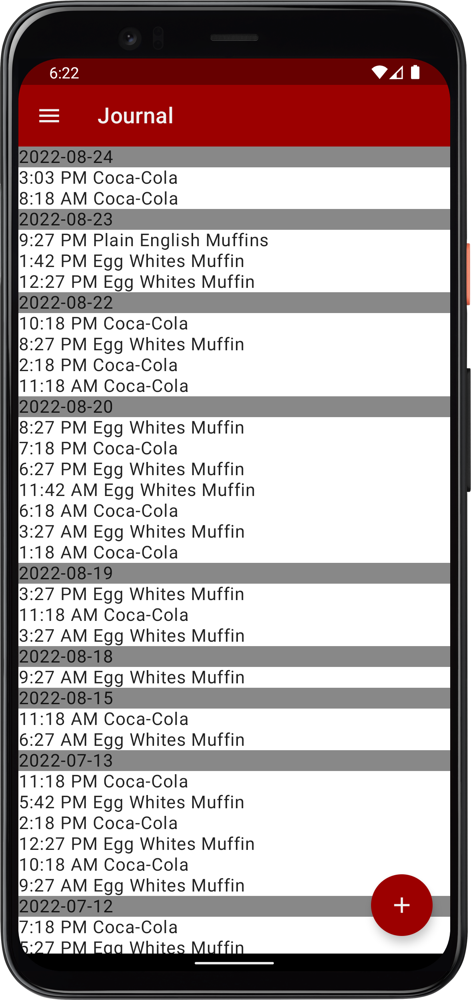
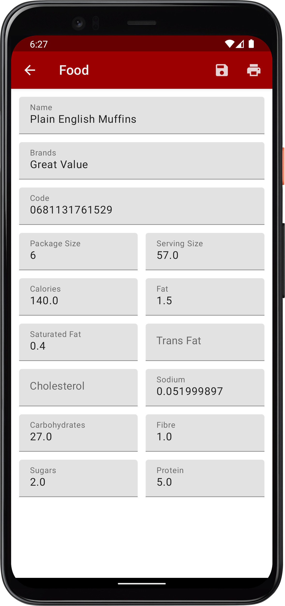
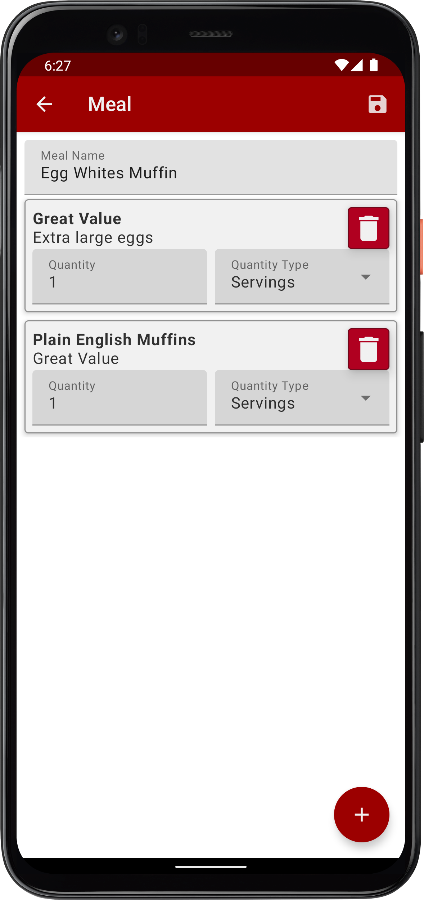
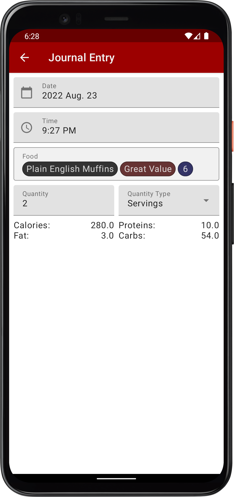

# CalorieCounter

A WIP Android app for counting calories.

It is written in Kotlin and uses Android Compose for gui and viewmodels for holding information. Uses Room for database access.

I wrote this application largely for learning purposes.

Some screenshots:

